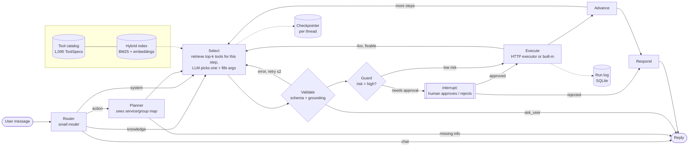

# Designing an agent that stays accurate with hundreds (or thousands) of tools

This is my answer to the Datazoic task. The code in this repo is a working version of the design: a LangGraph agent that can use the operations in PayPal's published REST specs (115, of which I kept 112 as agent tools), a RAG tool and a system-search tool, plus a scale test with 1,095 tools across PayPal, Stripe, Slack and Twilio. I've tried to explain the reasoning behind each decision, not only the decision, and to be upfront about what I measured versus what I'm arguing from experience.

---

## 1. The short version

The model should never see the whole tool catalog. I treat "which tool?" as a **search problem** first and an LLM problem second:

1. Every API operation is ingested as data (from OpenAPI or a Postman export) into a catalog with a name, description, compacted JSON schema and a risk level. One generic executor can call any of them, so adding a service means ingesting a spec, not writing code.
2. A planner breaks the request into steps, written in the API's own vocabulary. It only sees a map of services and capability groups, never individual tools.
3. For each step, a hybrid retriever (BM25 + embeddings) pulls the ~8 most relevant tools, scoped to the services the user actually has connected. The LLM picks one of those 8 (plus 4 always-on built-ins) and fills in the arguments.
4. Everything that shouldn't depend on the model is plain code: schema validation, a check that IDs and emails weren't invented, human confirmation before anything that moves money or contacts a customer, auth, retries, idempotency keys, pagination, and an audit log.

The effect is that the LLM's decision is always "choose between about 8 tools," whether the catalog has 50 entries or 5,000. The number that then matters is retrieval recall, which is cheap to measure and improve. In my experiment, going from 112 to 1,095 tools didn't hurt at all once retrieval was scoped to the right service. What did hurt was **overlap**: adding Stripe, which also has invoices, refunds, disputes and subscriptions, pulled recall@8 down from 0.82 to 0.71 until scoping fixed it. So at scale the problem isn't really *how many* tools there are. It's *how many look alike*.

---

## 2. Why more tools make an agent worse

It helps to be precise about the failure, because each cause needs a different fix.

- **Choice overload among near-duplicates.** PayPal alone has `invoices.send`, `invoices.remind`, `invoices.cancel`, `templates.create`, `invoices.create`... The model does fine picking between 8 clearly different tools and badly when there are 100 where 15 are plausible. Anthropic reported the same thing when they added tool search: on their internal MCP evaluations with large tool libraries, Opus 4 went from 49% to 74% when tools were loaded on demand instead of all at once ([Anthropic, Nov 2025](https://www.anthropic.com/engineering/advanced-tool-use)). The RAG-MCP paper measured roughly 13.6% vs 43.1% selection accuracy for all-tools vs retrieved-tools prompting ([Gan & Sun, 2025](https://arxiv.org/abs/2505.03275)).
- **Context cost.** Tool schemas are big. After I compacted them (more below), all 112 PayPal tools still come to about **72k tokens**, and all 1,095 tools to about **486k tokens**, per LLM call. The top 8 retrieved for a step average about **5.8k**. Beyond cost and latency, a long prompt dilutes attention for everything else in it.
- **Hard limits.** Some providers cap tools per request (OpenAI has historically rejected more than 128), so "just bind everything" stops being an option around this size anyway.
- **Parameter hallucination.** The more schemas are in context, the more likely the model is to mix fields between similar tools, or fill a required ID with something that looks right. Fewer tools helps, but I also don't trust the model here at all (section 8).

---

## 3. The architecture

To make it concrete, here is what happens for *"Send an invoice for $50 to vibheesh@example.com"*:

1. **Router** (cheap model): intent `action`, services `[paypal]`, and a standalone rewrite of the request (so "send it to her too" later becomes something retrievable).
2. **Planner**: `["Create a draft invoice for $50 USD billed to vibheesh@example.com", "Send the invoice created in step 1"]`. The planner knows PayPal has an `invoices (14)` group but has no idea what the endpoints are called. It doesn't need to.
3. **Select, step 1**: retrieval on the step goal returns `invoices.create` at rank 1, plus templates, QR codes and so on as near-misses. The model gets those 8 schemas plus `rag_search`, `system_search`, `analyze_data` and `ask_user`, and calls `paypal__invoices_create` with a body.
4. **Validate**: the arguments are checked against the JSON schema, and every email and URL ID in them must appear in the conversation or in an earlier result. `vibheesh@example.com` came from the user, so it passes.
5. **Guard**: creating a *draft* is a low-risk write, so it runs without asking. An idempotency key is generated and saved in the checkpoint *before* the call.
6. **Execute**: the executor handles OAuth and retries, and stores the full response. The next prompt only gets a trimmed preview. The key from step 5 goes out as `PayPal-Request-Id` only on endpoints where PayPal documents that header. Invoicing isn't one of them, so this write is sent exactly once and never replayed automatically (section 6).
7. **Select, step 2**: the goal "send the invoice created in step 1" retrieves `invoices.send` at rank 2, right behind `invoices.create` (the goal mentions the created invoice). That's the kind of near-miss the selector is there to resolve. The model reads the invoice ID from step 1's preview.
8. **Guard**: `invoices.send` is high risk (it emails a customer), so the graph **pauses** with an `interrupt()` showing the exact request. The state is checkpointed, so the approval can come a minute or a day later, from another process.
9. **Respond** once approved, with something like "Invoice INV2-... for $50.00 was sent to vibheesh@example.com."

That flow is in `tests/test_agent_flows.py::test_send_invoice_asks_for_confirmation_then_sends`, running through the real graph, real retrieval and the real executor against a mock PayPal. Only the LLM is scripted.

---

## 4. Agent structure

I considered four shapes.

**A. One ReAct agent with every tool bound.** This is the baseline the brief warns about. It's simple and works well up to maybe 15-30 tools, then degrades for the reasons in section 2. It's a non-starter at 1,000.

**B. One ReAct agent with tools retrieved per turn.** Much better, and it's the minimal version of the idea. The weakness is that the retrieval query is the raw user message. "Send an invoice for $50" needs `invoices.create` *and* `invoices.send`, but the message only says "send". A single retrieval also can't serve a request whose second step depends on the first step's output.

**C. A supervisor with one sub-agent per service** (a PayPal agent, a Stripe agent...). This is the popular "hierarchical multi-agent" answer, and it does shrink each agent's tool list. But it only moves the problem: the PayPal agent alone still has 112 tools, and with 100 services the supervisor is choosing between 100 agents, which is the same selection problem one level up. Every handoff also costs tokens and loses context. I'd use sub-agents when the *skills* are genuinely different (a reporting analyst that writes SQL, say), not as a way of sharding tools.

**D. Plan, then retrieve and act per step (what I built).** The roles are split by what each one needs to know:

| Role | Model | Sees | Decides |
|---|---|---|---|
| Router | small/fast | conversation, list of connected services | chat / knowledge / system / action; rewrites the request |
| Planner | main | service → capability-group map (grows with groups, not tools) | the steps, in API vocabulary, and each step's kind (API call, computation, knowledge lookup, system lookup); or asks a clarifying question |
| Selector | main | ~8 retrieved tools + 4 built-ins, earlier step results | which tool, which arguments |
| Responder | main | step statuses and result previews | the final message |
| Everything else | code | - | validation, confirmation, auth, retries, idempotency, pagination, logging |

The planner writing steps in the API's language is what makes retrieval work. The raw message *"What was my total sales volume last month?"* doesn't get the transaction-search endpoint into the top 20 at all (it matches "pricing", "products", and on the four-service catalog, Twilio's "usage records last month"). The planner's step *"List transactions between 2026-08-01 and 2026-08-31"* retrieves it at rank 2, because "list transactions" is the endpoint's own summary. It's query rewriting by something that has seen the capability map.

**Trade-offs I accepted.** Planning adds an LLM call to every action request, so simple single-call requests pay for a step they don't really need (a fast path for single read-only calls is an obvious optimisation). A plan written upfront can also be wrong when step 2 depends on what step 1 finds. I soften that by keeping steps high-level and choosing each step's tool only after earlier results are known, and the selector can always call `ask_user`. When a step fails, the run stops and reports exactly what did and didn't happen; re-planning around the failure is the extension I'd make next (section 12).

---

## 5. Tool selection and routing

This is the core of the design, so I'll go through each layer.

### 5.1 Tools are data

`agent/registry/` normalises every operation into a `ToolSpec`: id (`paypal.invoices.send`), LLM-safe name, service, group (OpenAPI tag or Postman folder), method, path, summary, description, a JSON schema split into `path` / `query` / `body`, a risk level, and the idempotency header the provider documents for that operation, if any.

- **OpenAPI loader**: handles OpenAPI 3.x and Swagger 2.0. I used PayPal's official specs ([paypal/paypal-rest-api-specifications](https://github.com/paypal/paypal-rest-api-specifications), 13 files, 115 operations) because they have real parameter schemas.
- **Postman loader**: the brief talks about a Postman collection, and that's how a lot of internal APIs actually live. Postman exports have no schemas, only example requests, so the loader infers them: `:id` and `{{id}}` segments become required path params, query examples become hints, and a raw JSON body becomes a schema by type inference. Token requests (`/v1/oauth2/token`) are skipped because auth belongs to the executor, and repeated request names get unique tool names. Point `python -m agent.registry.build --postman <file>` at an exported PayPal collection and it ingests it the same way. The loader is tested on collections that cover the shapes real exports have: repeated request names, token requests, string URLs, requests with no URL, form bodies.
- **MCP** would slot in the same way: an MCP server's tool list is already name + description + JSON schema.

**Schema compaction.** PayPal's `orders.create` body schema is enormous. Before a schema goes to the LLM I resolve `$ref`s, merge `allOf`, drop read-only (server-generated) fields, cap the depth at 4, keep required fields first, cap property counts at deeper levels, and drop noise like `pattern: "^.*$"` and `maxLength: 2147483647`. The API still validates everything and returns a clear 400 if the model gets something wrong, and the repair loop handles that. `invoices.create` goes into the prompt at about 3k tokens with everything needed to invoice someone.

**Risk levels.** Each tool is `read`, `write` or `high`. A heuristic gets most of them right (GET = read; DELETE = high; verbs like send / refund / capture / payout / cancel / accept = high; POST that's really a search = read), and `data/policy/tool_policy.json` is where a human fixes the rest. For PayPal that meant disabling three endpoints that should never be agent tools (a callback PayPal calls on the merchant, and two sandbox-only dispute simulators) and bumping one to high. I'd rather have a small reviewed override file than trust a heuristic with money.

### 5.2 Four layers of narrowing

1. **Intent routing**: chat, knowledge, system or action. Knowledge and system questions skip the planner and go straight to their tool.
2. **Service scoping**: only services the user has connected (`ENABLED_SERVICES`), narrowed further if they named one ("...in Stripe"). This turned out to be the most important layer at scale (5.4).
3. **Per-step hybrid retrieval**: top-k tools for the planner's step goal.
4. **LLM choice** among those k plus the 4 built-ins. `tool_choice` is forced so the model must call *something*, and `ask_user` is always offered so it has a legitimate way out instead of guessing. A step the planner marked as a computation or a lookup skips retrieval and offers only its own built-in plus `ask_user`. I added that after a live run in which the model answered the "sum the transactions" step with `rag_search` (to look up how sales volume is defined). The lookup succeeded, the step counted as done, and no total was ever computed. One tool call per step is only safe if the step can't be satisfied by the wrong kind of tool.

### 5.3 Why hybrid retrieval

BM25 is very good at the exact vocabulary APIs use (`capture`, `payout`, IDs, field names) and costs nothing. Embeddings catch paraphrase ("chargeback" ≈ dispute, "money back" ≈ refund). I fuse the two with Reciprocal Rank Fusion, which needs no score calibration between the two very different scales. Tool documents are field-weighted (summary > group > operation id > path > description > param names).

### 5.4 What I measured

`scripts/eval_retrieval.py` uses 78 queries I wrote in the way a user would phrase them ("nudge the customer who hasn't paid", "release the hold on the card"), each labelled with the correct PayPal tool(s). It runs them against catalogs of increasing size. The offline embedding model is WordLlama, a 16 MB static model that runs anywhere, deliberately weak so the numbers are a floor. Recall@k means "the right tool was among the k shown to the LLM":

| Catalog | Tools | Scope | Retrieval | R@5 | R@8 | R@10 |
|---|---|---|---|---|---|---|
| PayPal | 112 | - | BM25 only | 0.73 | 0.78 | 0.82 |
| PayPal | 112 | - | hybrid | **0.77** | **0.82** | **0.85** |
| + Slack + Twilio | 483 | none | hybrid | 0.77 | 0.81 | 0.85 |
| + Stripe | 724 | none | hybrid | 0.59 | 0.71 | 0.74 |
| All four | 1,095 | none | hybrid | 0.60 | 0.71 | 0.73 |
| All four | 1,095 | PayPal | hybrid | **0.78** | **0.82** | **0.83** |

(Full table with BM25/dense/hybrid for every size: `data/eval/retrieval_results.md`. The Stripe, Slack and Twilio specs are fetched at pinned commits, so re-running the script gives these same numbers.)

What I take from it:

- **Unrelated tools are almost free.** Adding 371 Slack and Twilio tools barely moved recall. They don't compete with "refund a capture".
- **Overlapping tools are what hurt.** Stripe has invoices, refunds, disputes, subscriptions and customers' saved cards. For "pause the customer's subscription", Stripe's `subscriptions/{id}/pause` is honestly a *better* lexical match than PayPal's `subscriptions.suspend`. Recall@8 dropped by 11 points.
- **Scoping recovers everything.** With the index holding all 1,095 tools but the search filtered to the user's service, the numbers are essentially the same as the PayPal-only catalog. Service context (which accounts are connected, what the user named, what the conversation is about) is worth more than any retrieval trick. When it's genuinely ambiguous ("refund the last payment" with both PayPal and Stripe connected), the right move is to ask.
- **The remaining misses are vocabulary gaps** ("customize the checkout page with my logo" → `web-profile.create`, "notify my server when a payment completes" → `webhooks.post`). Three things close most of that gap: a proper embedding model (the eval runs with `EMBEDDINGS=openai`); the planner rewriting the step in API terms (section 4 has the "sales volume" example, and the planner-style goals in `tests/test_retrieval.py` all retrieve the right tool at rank 1 or 2); and **doc2query at ingestion**, where an LLM writes 5-10 example user requests per tool that get indexed with it (`ToolSpec.examples` is there for this). I didn't generate those examples here because I also wrote the eval queries, and the two would leak into each other.

I want to be honest about the limits. It's 78 queries written by one person, and recall is an upper bound on end-to-end accuracy, not the accuracy itself. `scripts/eval_selection.py` measures the real thing (all 112 tools bound vs top-8 retrieved, same queries, with a real model). It is a paid-tier experiment: 20 queries are 40 model calls, twice the free tier's daily allowance, and the all-tools arm sends about 72k tokens per call. It also belongs on a provider that accepts 112 tools in one request, because Gemini refuses a request that size outright (section 10), which makes the point about binding everything but isn't a measurement. I built and tested this project on the free tier, so the numbers I report are the ones that tier can produce: retrieval recall here, and the live end-to-end results in section 12. The script is in the repo for anyone with a paid key.

### 5.5 Why not fine-tune a tool-calling model instead?

Fine-tuning on the catalog (the Gorilla / ToolLLM line of work) can make selection very accurate for a fixed set of APIs. But a catalog like this changes every time a provider ships an endpoint or a customer connects a new service, and each change would mean new training data and a new model. Retrieval absorbs that change for free: ingest the spec, rebuild the index, rerun the eval. If one service turned out to be both high-volume and stubbornly hard to retrieve for, I'd fine-tune the *embedding model* on logged (request, tool that worked) pairs before touching the LLM.

### 5.6 Routing inside the step

The selector sees the plan, the current step, and previews of earlier results, so it can wire outputs to inputs (the invoice ID from step 1 into the path of step 2). If none of the 8 tools fits, the model can call `ask_user`, or in a future version a `search_tools` built-in to re-query with different words. That second option is how Anthropic's tool-search tool works and I'd add it next.

---

## 6. State management

I separate state by lifetime and by who reads it.

**1. Working state of a request** (LangGraph state, checkpointed after every node, keyed by `thread_id`):
`messages` (user-visible conversation only), `request` (standalone rewrite), `services` in scope, `plan` (each step's goal, status, chosen tool, args, preview, error, attempt count, idempotency key), `cursor`, and `results` (full payloads by step).

Some decisions in there that matter:
- **Tool chatter stays out of `messages`.** The conversation history the LLM sees is just what the user and the assistant said to each other. Intermediate calls live in `plan` / `results`. That keeps history short across a long session, and the details are still reachable through `system_search` when the user asks what happened.
- **Big payloads stay out of prompts.** A month of transactions can be hundreds of records. The prompt gets a preview (first few items, no HATEOAS `links`, long strings cut, plus a note like `transaction_details (47 items)`), and the full data stays in state. `analyze_data` computes over the full data, so "total sales last month" is done with code, not by asking the model to add up numbers it partially saw. It also refuses to add amounts in different currencies together: asked for one plain sum over USD and EUR records, it returns one total per currency. Two exceptions to "cut long strings" came out of live runs. A knowledge-base answer is passed to later steps whole, because cut at 200 characters a definition lost its second condition before the step that had to apply it. And `analyze_data` takes its filters as a list of explicit conditions (`path`, `op`, `value`) instead of a free-form object, for the reason in section 10.
- **Idempotency keys are part of the state.** The key for a write is generated and checkpointed *before* the HTTP call. If the process dies mid-call and the graph resumes, it reuses the same key and the provider returns the original result instead of doing the work twice (`test_idempotency_key_prevents_duplicate_side_effects`). This only holds where the provider honours the key, and that turned out to be narrower than I assumed: PayPal's specs declare `PayPal-Request-Id` on 15 of its write endpoints (orders, captures, refunds, payouts, subscriptions) and **not on invoicing**. So the catalog records the header per tool at ingestion, and the executor only sends a key, and only auto-retries a write, where one is declared. Everywhere else a write goes out once, and a 5xx or timeout is reported as "outcome unknown, check before retrying" rather than replayed. The gap that leaves is a crash between an un-keyed call and its checkpoint, which needs a look-before-retry check (section 12).
- **Human approval is a checkpointed pause** (`interrupt()`), not a blocking `input()` inside a tool. Nothing is held in memory while waiting.

**2. Audit log** (`runlog.py`, SQLite): one row per request, one per tool call (tool, risk, args, status, HTTP code, attempts, latency, error). The checkpointer is the agent's scratchpad and gets overwritten as the graph moves. This is the business record, and it's what `system_search` reads to answer "what's the status of my last request?".

**3. Long-lived knowledge**: the tool catalog and the knowledge base. Both are read-only at runtime and rebuilt offline.

For production I'd move the checkpointer to Postgres, put large results in object storage with a reference in state, add TTLs, and redact PII before anything reaches logs or traces.

---

## 7. Scalability: 50 → 500 → 5,000

**What stays constant per request:** the selector's context (8 tools + 4 built-ins, ~6k tokens), the number of LLM calls (router + planner + one per step + responder, so N+3 for an N-step request plus any repairs, and on Gemini one extra call for a step whose chosen tool had to be shortened to fit, section 10), and the executor.

**What grows:**

| | 50-100 tools (one service) | ~500-1,000 (several services) | 5,000+ (a marketplace of integrations) |
|---|---|---|---|
| Selection | per-step retrieval, k=8 | same, plus **service scoping**, which becomes essential | same |
| Planner context | service/group map (31 groups for PayPal) | still fine (~250 groups for all four services) | the map itself gets too big: add a **service-retrieval stage** first (pick 3-5 services, then show their groups) |
| Index | in-memory BM25 + vectors | same (scoring 1,095 tools takes well under a millisecond here) | vector DB (pgvector / Qdrant), per-tenant filtering at query time |
| Retrieval quality | hand-written policy overrides, eval set per service | doc2query examples at ingestion, better embeddings | learn from logs: which tool succeeded for which request becomes new training/eval data |
| Ingestion | manual | `registry.build` from specs; schema compaction and risk heuristics are automatic | CI pipeline: ingest → policy review for new `high` tools → eval gate on recall |

**Multi-tenancy** falls out of the design: a user's `ENABLED_SERVICES` scopes retrieval, and validation rejects any tool from a service they haven't connected, even if the model somehow names one (`test_disabled_service_tools_are_rejected`).

**Throughput:** graph workers are stateless (all state is in the checkpointer), so they scale horizontally. The things worth caching are OAuth tokens (done), embeddings (done, on disk, keyed by text hash, so adding a service only embeds the new tools), and retrieval results for identical step goals.

**Cost:** binding all 1,095 tools would be ~486k tokens *per call*, which doesn't fit in most context windows at all. The retrieved set is ~6k.

---

## 8. Error handling

My principle: the model is allowed to be wrong, but it's never allowed to be wrong *silently*, and it never gets to decide on its own whether money moves.

| Failure | Where it's caught | What happens |
|---|---|---|
| Right tool not retrieved | selector sees only near-misses | it can call `ask_user`; the step goal plus the planner's API vocabulary make this rarer; recall is tracked by the eval |
| Wrong tool picked | schema validation usually fails; API returns 4xx | error fed back to the selector with the failed args; up to 2 repairs, then the step fails and is reported |
| Hallucinated parameters | JSON-schema validation (types, required fields, enums) | same repair loop with the exact validation message |
| A step "done" by the wrong kind of tool (a docs lookup instead of the computation) | step kind from the planner | computation and lookup steps offer only their own built-in plus `ask_user` (section 5.2) |
| Invented IDs or emails | **grounding check**: every URL ID and every email in the args must appear in the conversation or an earlier result | rejected with "don't invent ids, look it up or ask"; the model usually switches to a list/search tool or `ask_user` (`test_invented_ids_are_blocked_and_agent_asks_instead`) |
| Missing information | planner returns a clarification; selector calls `ask_user` | the question goes to the user; the next message re-enters with full history. The brief's own example ("Send an invoice for $50 to", with no recipient) should end here, not with a made-up email |
| API 400 / 404 / 409 / 422 | executor turns PayPal's `{name, message, details[]}` into a short message | fed back for repair (e.g. PayPal's 31-day limit on transaction search: the model narrows the range, `test_api_error_is_fed_back_and_repaired`); the idempotency key is reset because a corrected request is a new request |
| 401 | executor | refresh the OAuth token once and retry |
| 429 / 5xx / timeouts | executor | exponential backoff with jitter, honours `Retry-After`, max 3; **only** for GET/PUT/DELETE or writes to an endpoint that honours an idempotency key (429 is always retried, since the request never ran). Any other write that hits a 5xx or timeout fails with "outcome unknown" and is not replayed |
| Pagination breaks part-way | executor + execute node | the pages fetched so far are kept, and an "incomplete data" warning is attached to the step result so a total computed from it is reported as partial |
| Risky action | guard node | human approval with the exact method, path and body; rejection cancels that step and skips the rest |
| Partial failure in a multi-step plan | advance node | stop, mark remaining steps skipped, and report exactly what did and didn't happen. No automatic "compensation" (e.g. auto-refunding) because that's a money decision |
| Loops / runaway | `MAX_REPAIRS`, `MAX_PLAN_STEPS`, LangGraph recursion limit | bounded, then reported |
| Bug in a built-in tool | try/except around built-ins | becomes a step error, not a crashed run |
| Model provider fails (quota 429, overload 503) | LLM wrapper, then each node | the wrapper tries a fallback model straight away (an overload or a quota is per model), then waits 5 s and 15 s and goes round again; a spent daily quota is not waited on. If it still fails, it raises one error type and the node handles it. Router or planner: the turn ends with a reply saying nothing was changed. Selector: that step fails and the rest are skipped. Responder: the step statuses are reported without the model. The run is logged as failed, not left "running" |
| Provider refuses the tool schemas | Gemini adapter | schemas are fitted to the provider's size limits before the call (section 10); if still refused, one retry at half the size |

The responder is told to state only what the step results show. A cancelled or failed step is reported as such, never as done.

---

## 9. The two additional tools

Both are real tools in the same mechanism as the API tools: always offered to the selector, validated, logged, and callable in the middle of a plan (e.g. "check our refund policy, then refund"). For pure knowledge or system questions the router takes a fast path straight to them.

**RAG pipeline tool (`rag_search`).** The knowledge base in `data/knowledge/` is a handful of sample internal docs (invoicing playbook, disputes SOP, refund policy, month-end reporting, assistant FAQ). They're chunked by markdown heading because each section is self-contained and the heading makes a readable citation, which gives 26 chunks here. Retrieval is the same hybrid index as tool search. Generation is told to answer only from the excerpts and cite them as `[file > section]`. If nothing relevant is retrieved, the tool says so instead of letting the model improvise. The final answer lists its sources. For a large or messy corpus (PDFs, Confluence, tickets) I'd swap the internals for LlamaIndex's ingestion and a vector store, and keep the tool's interface as it is.

This tool also covers business definitions. "Sales volume" is ambiguous (gross or net of refunds? pending included?), and the month-end doc defines it. The planner can put a `rag_search` step before the numbers, and the answer says what's included.

**System search tool (`system_search`).** Two scopes:
- `capabilities`: "What tools are available for managing invoices?" runs the same tool retriever and returns the matching tool cards (id, method, path, summary, risk) plus the built-ins. Because it reuses the real index, the answer always matches the live catalog.
- `activity`: "What's the status of my last request?" reads the run log for this thread and returns recent requests with their status and every API call made (`paypal.invoices.send -> ok (HTTP 200)`).

The scope is picked from the query if not given. `test_system_search_capabilities_and_activity` covers both.

`analyze_data` and `ask_user` are the other two built-ins. I mention them because they're how the design avoids two common failures: arithmetic done in the model's head, and guessing instead of asking.

---

## 10. Framework choice and trade-offs

**I used LangGraph for orchestration and wrote the rest myself.** The deciding question was: which parts of this system are the actual design, and which are plumbing I don't want to reinvent?

The design is the catalog, the retrieval, the policy/guard and the executor. Those are plain Python in this repo with no framework in them (`agent/registry`, `agent/retrieval`, `agent/tools`). I'd want to own them in any stack, and it means only `agent/graph/` would change if I switched orchestrators.

The plumbing (durable state, pause-and-resume for human approval, streaming, tracing) is exactly what LangGraph provides:

| Option | Strengths | Drawbacks for this problem |
|---|---|---|
| **LangGraph** (chosen) | explicit state machine; checkpointing per thread; `interrupt()` for human-in-the-loop; conditional edges for repair loops; streaming; first-class LangSmith tracing | lower-level than an "agent in one line"; the API has moved a lot over the last two years (I mitigate by keeping the core framework-free); graph code is more verbose than a loop |
| LangChain agents (`create_agent`) | fastest way to a working ReAct agent; the newer version runs on LangGraph and has middleware that can filter tools per model call | the loop is implicit. I wanted plan, validate, guard and repair to be separate nodes I can test, trace and change independently |
| LlamaIndex | best-in-class ingestion and indexing for RAG; has object/tool retrieval | orchestration is less explicit than a graph. I'd happily use it *inside* the RAG tool for a big corpus |
| CrewAI | quick role-based multi-agent prototypes | agents conversing with each other means more tokens and less predictable control flow. For an agent that can send invoices, I want a deterministic graph, not a crew |
| DSPy | optimising prompts and modules against a metric | not a runtime; it's complementary. I already have eval sets, so DSPy is the natural next step for tuning the router and planner prompts |
| From scratch | total control, no churn | I did build the differentiating parts from scratch. Rebuilding checkpointing, interrupts and tracing would take weeks and add nothing |

Three smaller choices:
- **Hand-written BM25 instead of `rank_bm25`**, because I needed per-query masks for service scoping and it's about 30 lines.
- **Provider-agnostic LLM wrapper** (`init_chat_model`): Gemini, OpenAI, Anthropic or anything LangChain supports, with separate router and main models. The wrapper has a scripted twin for tests, which is why the whole graph can be tested offline and deterministically.
- **Gemini's free tier as the default model** (`gemini-3.8-flash`). The brief doesn't prescribe a provider, and a free default means a reviewer can run the agent without a paid key. Switching provider is one line in `.env`. Making Gemini work well taught me something worth knowing: LangChain's generic Gemini converter marks every nested field without a default as *required*, which would push the model to invent values for every optional query parameter. That is precisely the hallucination this design is trying to prevent. So the wrapper sends our compacted schemas to Gemini as plain JSON Schema instead, and leaves Gemini 3 at its default temperature, as Google recommends. A test (`tests/test_gemini_wiring.py`) runs the invoice flow through the real Gemini adapter with only the network call faked, to keep this from regressing.

  Running against the live API taught me a second thing, and it's the best argument in this document for testing with a real model. With a forced function call, Gemini rejects the request with a bare `400 INVALID_ARGUMENT` when the tool schemas are too big. The limit isn't documented, so I measured it: a single function is refused above roughly 270 schema nodes, and a whole request above roughly 450 nodes plus enum values. `orders.create` alone is over the first limit, and for 21 of my 78 eval queries the retrieved top-8 is over one of the two, so about a quarter of requests would have failed on my own default provider while every offline test passed. The adapter now fits the schemas on the way out. It drops whole optional fields, deepest first, and never touches a required one, and it shortens the lowest-ranked candidates first so the likeliest tool keeps everything. If the model then picks a tool that was shortened, it is asked once more with that tool alone at full size, plus `ask_user`. My first attempt cut by depth instead and left empty objects behind. Under a forced call the model can only send `{}` for those, and the live run duly produced an invoice line with `unit_amount: {}` three times in a row. The same rule bit my own built-in: `analyze_data` declared its filter as a free-form object, so on Gemini the filter always arrived empty and totals were silently unfiltered. It is now a list of explicit conditions. Some catalog tools still have a request body with no declared fields (the spec gives none), and on Gemini those can only be called with an empty body. The catalog itself is untouched, so validation still checks the full schema and other providers get the full schema.

---

## 11. Observability and evaluation

**LangSmith tracing** is on with `LANGSMITH_TRACING=true`. Each turn is one trace with a span per graph node. LLM calls are named `router`, `planner`, `selector`, `responder` and `rag_generate` so they're easy to filter, and tool retrieval shows up as a *retriever* run listing the candidate tools with their BM25, dense and fused scores. That's the first thing I'd look at when the agent picks a wrong tool: was the right one even retrieved? The thread ID is attached as metadata so a whole conversation can be pulled up.

**The run log** is the business-side audit: who asked for what and which API calls were made with which arguments. It's queryable from the agent itself.

**Evals as regression tests:**
- `scripts/eval_retrieval.py`: recall@k per catalog. I'd run it in CI whenever a spec, a policy or the embedding model changes.
- `scripts/eval_selection.py`: end-to-end selection accuracy with a real model, all-tools vs retrieved.
- `scripts/live_check.py`: the brief's example requests end to end against the real model (mock PayPal), with a pass/check report. It checks outcomes, not only that tools ran: the sales total is recomputed independently and must match.
- `pytest`: 48 tests covering the graph flows, the Gemini adapter, executor behaviour, loaders and built-ins.

**What I'd put on a dashboard:** retrieval recall on the eval set; selection accuracy; **repair rate per tool** (a tool that often needs repairs has a confusing schema or description, and fixing that is cheap); **confirmation decline rate** (if users reject a lot of proposed actions, the planner is misunderstanding them); API error rate by tool and status; tokens and latency per turn.

---

## 12. The PayPal scenario end to end, live results, and where I'd take it next

**"Send an invoice for $50 to ..."** is traced in section 3. As written in the brief the message has no recipient, and the planner is instructed to ask in that case rather than guess, which is the behaviour I'd want to see.

**"What was my total sales volume last month?"** Router: action. Planner: resolve "last month" against today's date to explicit dates, then three steps: list the transactions for the month (an API step), look up how "sales volume" is defined (a knowledge step), and compute the total using that definition (a computation step). Step 1 retrieves transaction search (`GET /v1/reporting/transactions`). The executor notices `total_pages > 1` and fetches every page (PayPal pages this endpoint, and stopping at page 1 would silently under-report). Step 2 is `rag_search`, which returns the definition from the month-end doc: completed incoming payments, refunds not netted, per currency. Step 3 is `analyze_data` with filters for completed, positive amounts, totalled per currency. No confirmation, because it's read-only. `test_sales_volume_paginates_and_computes_deterministically` checks the total against an independent calculation, and so does `live_check.py`, because this is the scenario where "the right tools ran" and "the answer is right" came apart: in successive live runs the agent skipped the computation, then summed euros into dollars, then filtered nothing, each time with every step marked done.

**"Is there a dispute open from user_123?"** `["List disputes that are still open", "From step 1, list the dispute ids whose buyer is user_123"]`, which is `disputes.list` with a state filter, then `analyze_data`. One caveat: in the real API, the list endpoint doesn't include the buyer, so it would be list → get each open dispute. My mock includes the buyer to keep the demo short. The proper fix is a bounded "for each" step type, below.

**Scaling to 500 APIs from different services** is section 5.4 and section 7. The short version: it holds up. The per-call context doesn't grow, and the thing to design for is overlapping services, which scoping handles.

**Live results.** I tested the brief's requests against live Gemini models with `scripts/live_check.py`, on Google AI Studio's free tier with the mock PayPal behind the executor. Every fix this document describes as coming from a live run was found this way: the schema-size limit (section 10), provider errors crashing a turn and overloads eating the quota (section 8), a step counted as done by the wrong tool (section 5.2), and the wrong sales totals above.

| Request | What the agent did | Result |
|---|---|---|
| Send an invoice for $50 to vibheesh@example.com | `invoices.create`, pause for approval, `invoices.send` | draft created for 50.00 USD, sent once approved |
| What was my total sales volume last month? | `search.get` (48 transactions over 3 pages), `rag_search` for the definition, `analyze_data` | USD 6,439.23 and EUR 1,212.90, equal to an independent calculation |
| Is there a dispute open from user_123? | `disputes.list`, `analyze_data` | PP-D-27803 (89.00 USD, waiting for the seller's response); the user's other dispute is reported as resolved |
| What tools are available for managing invoices? | `system_search`, capabilities | the 12 best-matching tools from the live catalog, led by the invoice ones (get, create, send, QR code) |
| What's the status of my last request? | `system_search`, activity | the previous request and that it succeeded |
| When do we add a late fee to an invoice? | `rag_search` | 1.5% after 30 days overdue, only with the contract clause, cited to the invoicing playbook |
| Send an invoice for $50 to | planner asks instead of planning | asks for the recipient's email; no tool is called |

The free tier allows 20 requests per model per day, so the set was run in two parts. Six of the seven rows are from one run. The sales-volume row is from re-running that scenario's lookup and computation after its last fixes, with the result checked against the same independent calculation the test suite uses.

**Where I'd take it next, in order:**
1. The selection eval on a paid tier (section 5.4), to put an end-to-end accuracy number next to the retrieval recall.
2. Doc2query examples at ingestion, with a separately written eval set to avoid leakage.
3. A `search_tools` built-in so the selector can re-query when none of the 8 fits.
4. A bounded fan-out step type ("for each open dispute, get details", max N).
5. Re-planning after a failed step, instead of stopping.
6. A fast path that skips the planner for single, read-only requests.
7. Per-user OAuth and secrets management. Right now there's one set of credentials per service from the environment.
8. Allowing an "edit" answer at the confirmation step (change the amount, then approve), not just approve or reject.
9. Look-before-retry for writes on endpoints with no idempotency key (e.g. search for the invoice before creating it again after a crash or an "outcome unknown" error).
10. Pagination and auth beyond PayPal's style. The executor follows `page` / `total_pages` and uses OAuth client credentials or a bearer token. Stripe's cursors and Twilio's basic auth would each be a small adapter chosen per service.

The mock PayPal is a simplification: it models invoices, transactions (with pagination and the 31-day rule), balances and disputes, and returns generic success for other endpoints. With `PAYPAL_CLIENT_ID` and `PAYPAL_CLIENT_SECRET` set, the same code talks to the PayPal sandbox.
